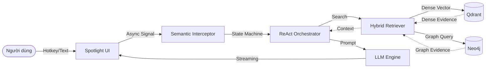
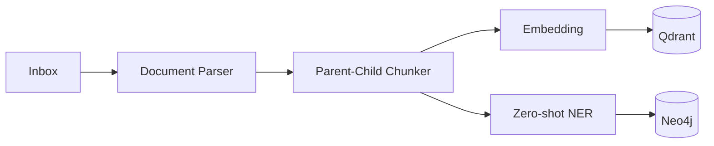

# Digital Scholar (Agent V5.0)

## 1. Project Overview

**Digital Scholar** là một trợ lý nghiên cứu học thuật chạy nền (Background Daemon) dành riêng cho hệ điều hành **Windows 10/11**. Dự án tập trung giải quyết bài toán số hóa, quản lý và truy xuất thông tin từ kho tài liệu khoa học cá nhân (PDF, PPTX) mà không phá vỡ luồng làm việc của người dùng. Hệ thống kết hợp kiến trúc Clean Architecture chặt chẽ với nền tảng Hybrid Retrieval (Truy xuất lai).

**Why Digital Scholar?**
- *Traditional desktop search* ➔ Lexical Search ➔ No reasoning ➔ No academic context
- *Digital Scholar* ➔ Semantic Retrieval ➔ Graph Retrieval ➔ AI Reasoning

## 2. Key Capabilities

- ✔ Desktop AI Assistant
- ✔ Background Document Indexing
- ✔ Hybrid Retrieval Pipeline
- ✔ Voice Interface
- ✔ Clean Architecture
- ✔ Plug-and-Play LLM Providers

## 3. Quick Start

**Yêu cầu hệ thống:** Windows 10/11 (64-bit), Python 3.11.x, 8GB RAM.

```bash
# 1. Clone repository
git clone <repo_url>
cd agent_nckh

# 2. Tạo môi trường ảo và cài đặt dependencies
python -m venv venv
venv\Scripts\activate
pip install -r requirements.txt

# 3. Khởi tạo biến môi trường (.env)
# Yêu cầu: GEMINI_API_KEY, OPENROUTER_API_KEY, NEO4J_URI...

# 4. Chạy hệ thống (Chạy với quyền Administrator để bắt hotkey)
python main.py
```

## 4. System Architecture

Hệ thống tuân thủ **Clean Architecture**, phân lớp luồng dữ liệu (Dependency Direction) nghiêm ngặt từ ngoài vào trong lõi.



## 5. Technology Stack

| Layer | Technology |
|---|---|
| **UI** | PyQt6 |
| **LLM** | Gemini / OpenRouter |
| **Vector DB** | Qdrant |
| **Graph DB** | Neo4j Aura |
| **Embedding** | multilingual-e5-base |
| **STT Voice** | Gemini Flash API (In-memory PCM) |
| **Document Parser** | PyMuPDF, python-pptx |

## 6. High-level Pipelines

**1. Query Processing Flow (Luồng hệ thống cốt lõi)**
Dưới đây là vòng đời của một truy vấn từ người dùng tới khi sinh ra văn bản trả lời (streaming):

`User ➔ Spotlight UI ➔ Semantic Interceptor ➔ ReAct Orchestrator ➔ Hybrid Retriever ➔ LLM ➔ Streaming UI`

**2. Background Document Indexing Pipeline**
Luồng tự động chạy ngầm khi phát hiện tài liệu mới trong thư mục Inbox:



*(Chi tiết về thuật toán RAG, Parent-Child Chunking và Voice Pipeline, xem tại [Engineering Handbook](docs/engineering/pipelines.md))*

## 7. Key Technical Contributions

Dự án mang lại các đóng góp kỹ thuật thực tiễn sau:
- **Integration of Parent-Child Chunking** vào một luồng Hybrid Academic RAG để cân bằng giữa độ chính xác truy xuất (Vector Search) và độ trọn vẹn ngữ cảnh.
- **Hybrid Retrieval Pipeline** kết hợp dense retrieval (Qdrant) với graph evidence (Neo4j) để giải quyết các truy vấn mang tính liên kết logic.
- **Adaptive Retrieval Loop** đưa Agent tự đánh giá (Self-Critique) chất lượng của tập dữ liệu ngữ cảnh thu hồi được trước khi sinh câu trả lời, giảm thiểu ảo giác.
- **Utilization of Lightweight LLMs for Zero-shot Entity Extraction** để tự động bóc tách thực thể trong tiến trình Background Indexing.
- **AST-based Architecture Validation** quét mã nguồn bằng Abstract Syntax Tree (AST) để tự động bảo vệ nguyên lý Clean Architecture trong một dự án AI Research.

## 8. Current Status & Roadmap

- **Phiên bản hiện tại:** V5.0

**Implemented Features:**
- Hybrid indexing pipeline
- Hybrid retriever foundation
- Graph extraction pipeline
- Spotlight UI and Voice Interface
- AST-based architecture validation

**Current Limitations:**
- *Graph evidence fusion into generation is still under refinement*: Luồng truy xuất hiện tại đã lấy được dữ liệu Graph nhưng cần tinh chỉnh thêm prompt tổng hợp để LLM sử dụng dữ liệu này hiệu quả nhất.
- Chưa có OCR cho các tài liệu PDF scan dưới dạng hình ảnh.

**Planned:**
- Tích hợp Pytest-qt cho UI Testing tự động.
- Áp dụng Local LLM thay thế hoàn toàn API đám mây.
- Bổ sung Vision Mode để phân tích biểu đồ khoa học.

## 9. Repository Structure

```text
agent_nckh/
├── main.py                     (Composition Root)
├── production_check.py         (AST-based architecture validation tool)
├── run_tests.py                (Automated Test Runner)
├── src/
│   ├── core/                   (Application Layer)
│   │   ├── orchestrator.py     (ReAct state machine)
│   │   ├── interfaces.py       (Abstract base classes)
│   │   └── semantic_interceptor.py
│   ├── infrastructure/         (Infrastructure Layer)
│   │   ├── gemini_client.py    (LLM & STT adapters)
│   │   └── openrouter_client.py
│   ├── db/                     (Database Layer)
│   │   ├── hybrid_rag.py       (Qdrant & Neo4j orchestration)
│   │   └── nckh_retriever.py   (Parent-Child retrieval logic)
│   ├── ui/                     (Presentation Layer)
│   │   ├── spotlight.py        (PyQt6 UI)
│   │   └── workers.py          (QThread handlers)
│   └── shared/                 (Foundation Layer)
├── docs/                       (Tài liệu kiến trúc, ADRs)
└── rules/                      (Tập luật A/B/C)
```

## 10. Design Philosophy

Dự án được xây dựng dựa trên các triết lý kỹ thuật nghiêm ngặt:
- **Modular rather than monolithic:** Chia nhỏ hệ thống thành các module độc lập.
- **Replaceable LLM providers:** Không phụ thuộc vào một hãng AI cố định, giao tiếp qua Abstract Interfaces.
- **Offline-first indexing:** Việc bóc tách và phân loại tài liệu diễn ra tự động ở chế độ nền.
- **Deterministic retrieval:** Truy xuất dữ liệu có thể lặp lại và kiểm chứng được.
- **Testability over convenience:** Ưu tiên khả năng viết Unit Test thay vì code nhanh cẩu thả.
- **Separation between orchestration and infrastructure:** Lõi điều phối (ReAct) hoàn toàn cách ly khỏi cơ sở hạ tầng (DB, HTTP Clients).

## 11. Development Workflow

Dự án áp dụng quy trình phát triển kỹ thuật chặt chẽ:
`Design (ADR) ➔ Implementation ➔ production_check.py ➔ run_tests.py ➔ Commit`

- Mọi quyết định thay đổi hệ thống đều phải lập văn bản **ADR** (Architecture Decision Record).
- Giao tiếp qua **Abstract Interfaces** (Dependency Inversion), cấm khởi tạo service ngoại vi bên trong core.
- `production_check.py` đóng vai trò kiểm duyệt Abstract Syntax Tree (AST) để báo lỗi nếu import sai luồng.
- `run_tests.py` thực thi 51 bài test trước mỗi commit.

## 12. Technical Documentation

Toàn bộ các quyết định thiết kế chi tiết, thông số thuật toán, và hướng dẫn bảo trì đã được tách ra khỏi README và nằm trong thư mục `docs/`.

- [Engineering Principles & Rule Engine](docs/engineering/principles.md)
- [Pipeline Algorithms (RAG, Chunking, Voice)](docs/engineering/pipelines.md)
- [Architecture Decision Records (ADRs)](docs/adr/)
